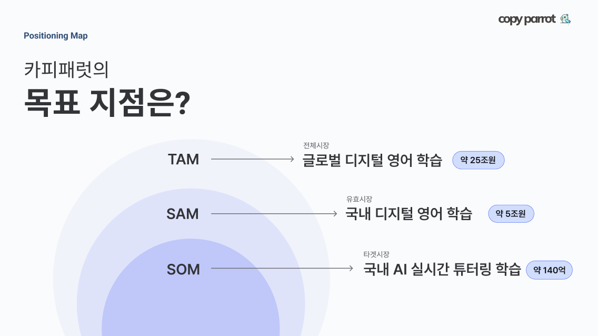

#  NxtCloud Hackathon Dopamine Defense 팀
일시 : 2024년 11월 9일 17시 ~ 2024년 11월 10일 12시
## 개발 환경

| Spring Boot | 3.1.4  |
|-------------|--------|
| Kotlin      | 1.9.10 |
| Webflux     | latest |
| dev.miku:r2dbc     | 0.8.2  |

## 앱 시연 영상

## Why used Webflux
`실시간 데이터 스트리밍` CopyParrot의 핵심 기능인 번역과 STT의 경우 사용자에게 즉각적으로 응답을 전달해야하기 때문에 WebFlux를 이용하여 반응형 스트림을 통해 데이터가 준비되자마자 즉시 전송하여 빠르고 지연 없도록 구현하였습니다.

## 발표 자료 (Presentation created by [@12novel30](https://github.com/12novel30))

